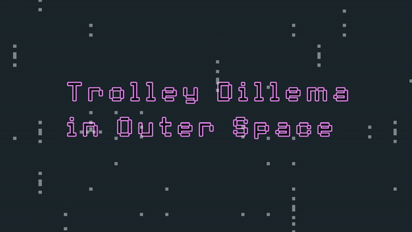
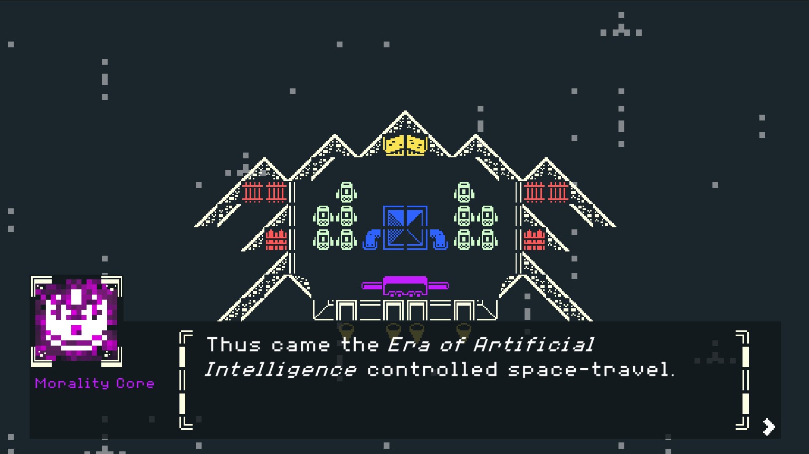
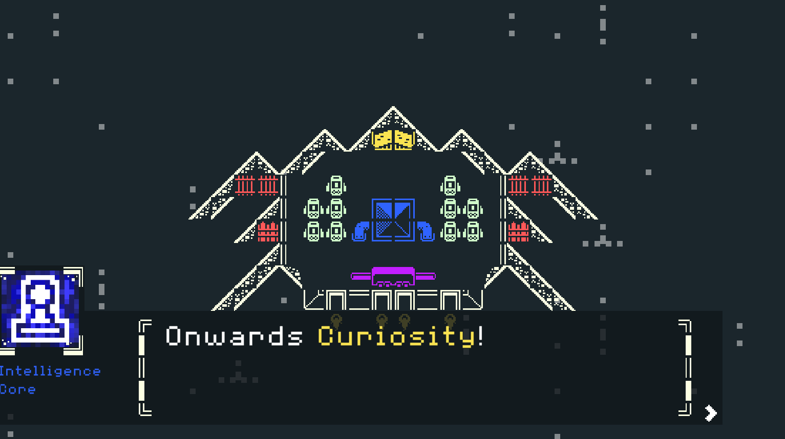

# Trolley-Problem-in-Outer-Space

[Try it out](https://rafael-ribeiro1510.itch.io/trolley-problem-in-outer-space)

- **Project name:** Trolley Problem in Outer Space
- **Short description:** Submission for the [1st Miz Jam](https://itch.io/jam/miz-jam-1), where everyone was given the same **art kit** - [Kenney's 1-Bit Pack](https://kenney.nl/assets/bit-pack)
- **Environment:** WebGL
- **Tools:** Unity, C#
- **Group members:** 
    - [Rafael Soares Ribeiro](https://github.com/up201806330) ([up201806330@fe.up.pt](mailto:up201806330@fe.up.pt))

## Controls
- `Left mouse click` to progress.

## Screenshots

